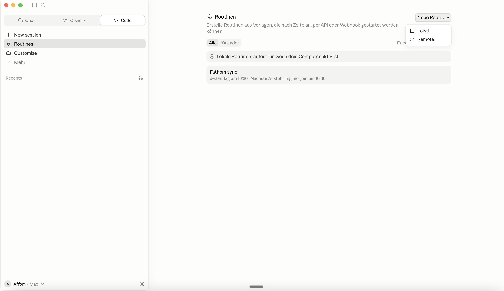
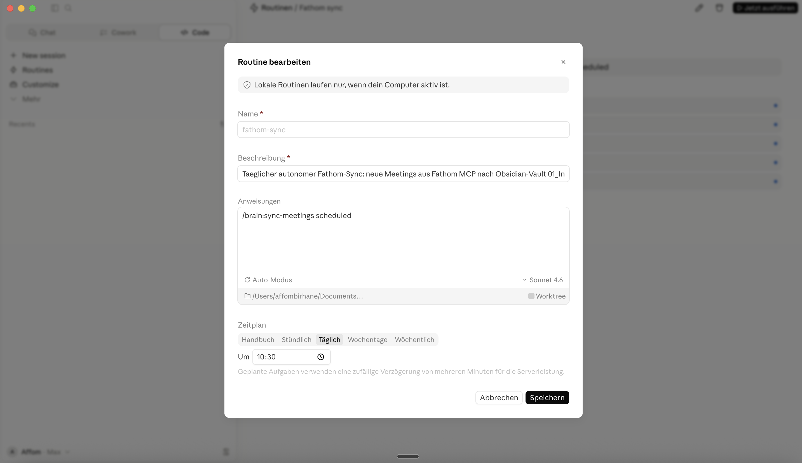

# Fathom-Sync als Routine im Claude Code einrichten

Du hattest deinen Fathom-Sync bisher als **Scheduled Task in Claude Cowork** laufen. Diese Anleitung migriert ihn auf eine **Routine im Claude Code** (Reiter in der Claude-Desktop-App).

## Warum migrieren?

Claude Cowork und Claude Code haben **getrennte Skill-Bibliotheken**.

Alles, was wir bisher als Skill angelegt haben, ist über Claude Code erreichbar: im Terminal, in Cursor und im Reiter **Code** der Claude-Desktop-App. Alle drei zeigen auf dasselbe Verzeichnis. In **Claude Cowork** ist die Skill-Bibliothek **nicht verfügbar**, da hier eine gesonderte Skill-Bibliothek gepflegt wird.

Was bisher passiert ist: der Scheduled Task hat die Beschreibung und den `brain:sync-meetings`-Aufruf selbst **interpretiert** und oft das Richtige getan, aber nicht den tatsächlichen Skill aufgerufen. Funktioniert zufällig, nicht zuverlässig.

**Lösung:** Routine im Claude Code. Dort wird der Skill **deterministisch** aufgerufen, weil die Skill-Bibliothek im selben Kontext liegt.

## Schritt 1: Alte Scheduled Task in Claude Cowork löschen

1. Claude-Desktop-App öffnen, oben links im Fenster auf den Reiter **Cowork** klicken
2. Zu **Scheduled Tasks** navigieren
3. Den Fathom-Sync-Task finden
4. **Löschen**

Damit verhindert, dass später zwei Syncs parallel laufen und Duplikate erzeugen.

## Schritt 2: Routine im Claude Code anlegen

1. Oben auf den Reiter **Code** wechseln (neben „Chat" und „Cowork")
2. Links in der Seitenleiste auf **Routines**
3. Oben rechts auf **Neue Routine** → **Lokal**



## Schritt 3: Routine ausfüllen

Es öffnet sich ein Dialog „Routine bearbeiten". Folgende Felder ausfüllen:



| Feld | Wert |
|---|---|
| **Name** | `fathom-sync` (oder ein Name deiner Wahl) |
| **Beschreibung** | `Täglicher autonomer Fathom-Sync: neue Meetings aus Fathom MCP nach Obsidian-Vault 01_Inbox/, mit Personen-Cross-Linking und Projekt-Matching.` |
| **Anweisungen** | `/brain:sync-meetings scheduled` |
| **Auto-Modus** | aktivieren |
| **Verzeichnis** | `~/Documents/Second-Brain` auswählen |
| **Modell** | Sonnet 4.6 |
| **Zeitplan** | **Täglich**, z.B. um **10:30** (wähle eine Zeit, zu der dein Rechner läuft) |

Auf **Speichern** klicken.

## Schritt 4: Testlauf

1. Die neu angelegte Routine in der Liste anklicken
2. **Jetzt ausführen** (oben rechts)
3. Den Chat-Verlauf beobachten:
   - Sollte ohne Permission-Prompts durchlaufen
   - Am Ende: Liste der neu synchronisierten Meetings
   - Neue Meetings landen in `~/Documents/Second-Brain/01_Inbox/`

Wenn alles glatt durchgelaufen ist: **Migration erfolgreich**. Du bist fertig.

## Schritt 5 (Optional): Permission-Fallback

Manchmal fragt Claude trotz aktiviertem Auto-Modus nach Berechtigungen für einzelne Tools. Falls dir das im Testlauf passiert: kopiere den folgenden Block 1:1 in einen frischen Claude-Code-Chat (egal aus welchem Projekt heraus). Claude ergänzt die fehlenden Permissions selbst in deiner `~/.claude/settings.json`, ohne dass du selbst editieren musst.

````markdown
Ich brauche deine Hilfe, meine Claude-Code-Settings sauber zu erweitern.

Bitte:

1. Lies `~/.claude/settings.json`.
2. Prüfe das `permissions.allow`-Array.
3. Ergänze die folgenden Einträge darin. Wichtig: **keine Doppelungen erzeugen, keine bestehenden Einträge überschreiben, keine Kollisionen verursachen**. Wenn ein Eintrag schon da ist, überspringen.

```json
[
  "Read(~/Documents/Second-Brain/**)",
  "Glob(~/Documents/Second-Brain/**)",
  "Grep(~/Documents/Second-Brain/**)",
  "Bash(ls ~/Documents/Second-Brain/**)",
  "Bash(find ~/Documents/Second-Brain/**)",
  "Bash(wc -l ~/Documents/Second-Brain/**)",
  "Bash(tail:*)",
  "Bash(head:*)",
  "Bash(awk:*)",
  "Bash(mkdir:*)",
  "Bash(date:*)",
  "Bash(grep:*)",
  "Read(~/.claude/project-repos.yaml)",
  "Write(~/Documents/Second-Brain/01_Inbox/**)",
  "Edit(~/Documents/Second-Brain/01_Inbox/**)",
  "Edit(~/Documents/Second-Brain/00_Meta/system/.last-fathom-sync)",
  "Edit(~/Documents/Second-Brain/00_Meta/system/vault-log.md)",
  "Edit(~/Documents/Second-Brain/00_Meta/system/vault-index.md)",
  "mcp__claude_ai_Fathom__list_meetings",
  "mcp__claude_ai_Fathom__get_identity",
  "mcp__claude_ai_Fathom__get_meeting_summary",
  "mcp__claude_ai_Fathom__get_meeting_transcript",
  "mcp__claude_ai_Fathom__get_recording_by_url",
  "mcp__claude_ai_Fathom__get_recording_by_call_id",
  "mcp__claude_ai_Fathom__search_meetings",
  "mcp__claude_ai_Fathom__find_person"
]
```

4. Validiere die Datei danach mit `jq . ~/.claude/settings.json > /dev/null`. Wenn die Validierung fehlschlägt, korrigiere den Syntaxfehler.
5. Gib mir am Ende eine kurze Liste: welche Einträge hast du neu ergänzt, welche waren schon da.

Danach beende ich die Claude-Desktop-App komplett (Cmd+Q) und starte sie neu, damit die Settings geladen werden. Dann teste ich die Routine erneut.
````

Nach Abschluss: Claude-Desktop-App **komplett beenden** (macOS: `Cmd+Q`, nicht nur Fenster schließen) und neu öffnen. Dann Testlauf aus Schritt 4 wiederholen.

## Wenn etwas nicht klappt

**Keine neuen Meetings im Inbox**
- Fathom-Connector aktiv? In der Claude-Desktop-App unten links auf deinen Namen klicken, dann **Einstellungen → Konnektoren** prüfen
- Im Routine-Chat-Verlauf nach Fehlermeldungen suchen. Wenn unklar: einen neuen Claude-Code-Chat öffnen (egal aus welchem Projekt), das Problem schildern, den Chatverlauf mitschicken und nach einem Lösungsansatz fragen

**Neue Meetings landen nicht in `01_Inbox/`, sondern in `02_Projects/`**
- Datei manuell zurück nach `~/Documents/Second-Brain/01_Inbox/` verschieben
- Einsortieren in den richtigen Projekt-Ordner macht später `/brain:sort-inbox`, nicht die Sync-Routine

**Trotz Schritt 5 immer noch Permission-Prompts**
- Hast du die App **komplett beendet** (Cmd+Q) und neu gestartet? Settings werden nur beim App-Start geladen.
